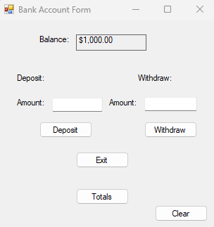

# Account Simulator (C#)

https://github.com/pmaitlen/Account-Simulator-CSharp/blob/main/BankAccount.cs

A C# WinForms application that simulates a basic bank account.

## Features
- Deposit and withdrawal functionality
- Input validation with user feedback
- Separation of business logic and UI logic
- Tracks total deposits, withdrawals, and transactions
- Clear button to reset input fields

## Technologies
- C#
- .NET WinForms

## Purpose
Originally created as coursework and later improved to demonstrate clean structure, validation, and usability.
